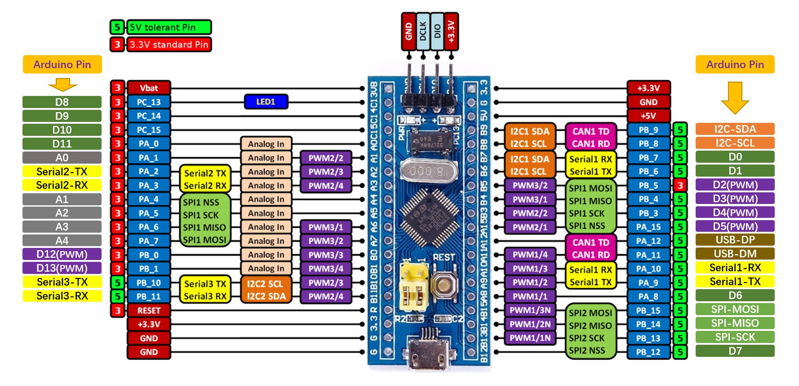

# STM32F103 Blue-Pill开发板的Arduino生态兼容说明

## 1 RTduino - RT-Thread的Arduino生态兼容层

STM32F103 Blue-Pill开发板已经完整适配了[RTduino软件包](https://github.com/RTduino/RTduino)，即RT-Thread的Arduino生态兼容层。用户可以按照Arduino的编程习惯来操作该BSP，并且可以使用大量Arduino社区丰富的库，是对RT-Thread生态的极大增强。更多信息，请参见[RTduino软件包说明文档](https://github.com/RTduino/RTduino)。

### 1.1 如何开启针对本BSP的Arduino生态兼容层

Env 工具下敲入 menuconfig 命令，或者 RT-Thread Studio IDE 下选择 RT-Thread Settings：

```Kconfig
Hardware Drivers Config --->
    Onboard Peripheral Drivers --->
        [*] Support Arduino
```

## 2 Arduino引脚排布



该BSP遵照Arduino UNO板的引脚排列方式，并扩展增加了Blue-pill自身的板载资源功能引脚。详见 `pins_arduino.c`

| Arduino引脚编号 | STM32引脚编号 | 5V容忍 | 备注                                                         |
| --------------- | ------------- | ------ | ------------------------------------------------------------ |
| 0 (D0)          | --            |        | 该引脚在UNO板中为串口RX引脚，不可当做普通IO                     |
| 1 (D1)          | --            |        | 该引脚在UNO板中为串口TX引脚，不可当做普通IO                     |
| 2 (D2)          | PB9           | 是     | I2C1-SDA，被RT-Thread的I2C设备框架i2c1总线接管，不可当做普通IO  |
| 3 (D3)          | PB8           | 是     | I2C1_SCL，被RT-Thread的I2C设备框架i2c1总线接管，不可当做普通IO  |
| 4 (D4)          | PB7           | 是     |                                                              |
| 5 (D5)          | PB6           | 是     |                                                              |
| 6 (D6)          | PB5           | 否     | PWM3-CH2（定时器3发生）                                       |
| 7 (D7)          | PB4           | 是     | PWM3-CH1（定时器3发生）                                       |
| 8 (D8)          | PB3           | 是     | PWM2-CH2（定时器2发生）                                       |
| 9 (D9)          | PA15          | 是     | PWM2-CH1（定时器2发生）                                       | 
| 10 (D10)        | PA12          | 是     | USB-DB，不可当做普通IO                                        |
| 11 (D11)        | PA11          | 是     | USB-DM，不可当做普通IO                                        |
| 12 (D12)        | PA10          | 是     | UART1-RX，被RT-Thread的UART设备框架uart1接管，不可当做普通IO    |
| 13 (D13)        | PA9           | 是     | UART1-RX，被RT-Thread的UART设备框架uart1接管，不可当做普通IO    |
| 14 (D14)        | PA8           | 是     | PWM1-CH1（定时器1发生）                                       |
| 15 (D15)        | PB15          | 是     |                                                              |
| 16 (D16)        | PB14          | 是     |                                                              |
| 17 (D17)        | PB13          | 是     | PWM1-CH1N（定时器1发生）                                      |
| 18 (D18)        | PB12          | 是     |                                                              |
| 19 (D19)        | PC13          | 否     | 板载LED默认引脚                                               |
| 20 (D20)        | PC14          | 否     |                                                              |
| 21 (D21)        | PC15          | 否     |                                                              |
| 22 (D22)        | PA2           | 否     | UART2-TX，被RT-Thread的UART设备框架uart2接管，不可当做普通IO    |
| 23 (D23)        | PA3           | 否     | UART2-RX，被RT-Thread的UART设备框架uart2接管，不可当做普通IO    |
| 24 (D24)        | PA5           | 否     | SPI-SCK， SPI功能尚未完全实现，目前仅作普通IO使用               |
| 25 (D25)        | PA6           | 否     | SPI-MISO，SPI功能尚未完全实现，目前仅作普通IO使用               |
| 26 (D26)        | PA7           | 否     | SPI-MOSI，SPI功能尚未完全实现，目前仅作普通IO使用               |
| 27 (D27)        | PB10          | 是     | UART3-TX，被RT-Thread的UART设备框架uart3接管，不可当做普通IO    |
| 28 (D28)        | PB11          | 是     | UART3-RX，被RT-Thread的UART设备框架uart3接管，不可当做普通IO    |
| A0              | PA0           | 否     | ADC                                                          |
| A1              | PA1           | 否     | ADC                                                          |
| A2              | PA4           | 否     | ADC                                                          |
| A3              | PB0           | 否     | ADC                                                          |
| A4              | PB1           | 否     | ADC                                                          |
| A5              | --            |        | 芯片内部参考电压 ADC                                          |
| A6              | --            |        | 芯片内部温度 ADC                                              |

> 注意：
>
> 1. 驱动舵机和analogWrite函数要选择不同定时器发生的PWM信号引脚，由于STM32的定时器4个通道需要保持相同的频率，如果采用相同的定时器发生的PWM分别驱动舵机和analogWrite，可能会导致舵机失效。
> 4. D10引脚是PWM反相位引脚(也就是常说的互补输出引脚CHxN)。但是这里不用考虑到占空比互补问题（CHx-20%，CHxN-80%），直接正常使用即可。
> 4. STM32的PA15引脚默认作为JTAG下载使用，但是如果采用SWD调试时，PA15(D9)可以作为普通的IO口使用，但是需要设置一些寄存器。

> 参考资料
>
> 1. 暂无

## 3 I2C总线

STM32F103 Blue-Pill板的I2C总线是板上丝印的 `SCL/D3` 和 `SDA/D2` 引脚，这两个引脚是被RT-Thread I2C设备框架接管的，不需要直接操控这两个引脚，直接引用`#include <Wire.h>`（Arduino官方I2C头文件）即可使用。
